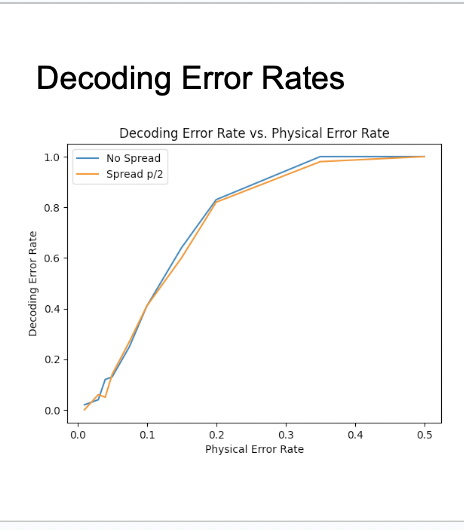

# Quantum LDPC Code Simulation

A collection of Jupyter notebooks implementing and analyzing quantum Low-Density Parity-Check (LDPC) codes using Qiskit.

## Overview

This project explores quantum error correction using bicycle LDPC codes across multiple stages:

- **Initialization:** 24 qubits (12 data + 12 ancilla) prepared in |0⟩ states.
- **Encoding:** Data qubits encoded via bicycle LDPC code (Hx, Hz, CNOT, CZ).
- **Error Injection:** Random bit-flip (X) and phase-flip (Z) errors introduced.
- **Syndrome Measurement:** Ancilla qubits measure stabilizers without collapsing logical information.
- **Decoding:** Belief Propagation + Ordered Statistics Decoding (BP-OSD).
- **Error Correction:** Apply corrections based on decoding.
- **Decoding Circuit:** Inverse encoding applied to return to logical basis.
- **Measurement:** Logical qubits measured to verify recovery.
- **Logical Error Analysis:** Compare measured and expected logical states.


## Repository Structure

```
QUANTUM LDPC/
├── env/                       
├── notebooks/                  
│   ├── Encoder/                # Notebooks: unicycle and bicycle code encoder circuits
│   ├── Encoder + Decoder/      # Encoder and decoder workflows test
│   ├── Final Notebooks/        # Finalized analysis and plotting notebooks: Focus on these
│   └── Tests/                  
├── Results/                    # figures   
├── requirements.txt            
└── README.md                  
```

## Prerequisites

- Python 3.8+
- Qiskit
- NumPy, SciPy
- matplotlib

Install via:

```
pip install -r requirements.txt
```

Or create Conda environment:

```
conda env create -f environment.yml
conda activate quantum-ldpc
```

## Usage

1. Clone the repository:
   ```bash
   ```

git clone [https://github.com/yourusername/quantum-ldpc.git](https://github.com/yourusername/quantum-ldpc.git) cd quantum-ldpc

````
2. Activate the environment.
3. Launch JupyterLab:
   ```bash
jupyter lab notebooks/
````

4. Run notebooks in numerical order.

## Notebooks

- **01-code-construction.ipynb:** Generates bicycle LDPC parity-check matrix and encoding circuits.
- **02-noisy-simulator.ipynb:** Builds noisy simulator with homogeneous and realistic noise models.
- **03-syndrome-measurement.ipynb:** Implements stabilizer measurement circuits.
- **04-decoding.bp\_osd.ipynb:** Demonstrates BP-OSD decoding with performance metrics.
- **05-performance.ipynb:** Plots logical error rates vs. physical error rates across noise spreads.
- **06-fidelity.ipynb:** Evaluates Hellinger fidelity for state preparation under realistic topologies.

## Figures

  
*Figure 1: Plots the logical error rate of the bicycle LDPC code against varying physical error rates, highlighting thresholds where logical protection becomes effective.*


  
*Figure 2: Displays the decoder’s raw error rate across noise levels, showcasing the robustness of BP-OSD decoding.*


  
*Figure 3: Compares performance metrics between pure BP decoding and BP+OSD across different noise parameters.*


  
*Figure 4: Shows the Hellinger fidelity of the prepared logical state under ideal and noisy conditions, quantifying the match to the target distribution.*


  
*Figure 5: Presents fidelity results using mirror benchmarking methodology, simplifying the verification of encoding and decoding circuits.*


---

## References

- MacKay et al., IEEE Trans. on Info. Theory, 2004
- Roffe et al., arXiv:2005.07016
- Li et al., New J. Phys. 17, 023037 (2015)
- arXiv:2401.07583


